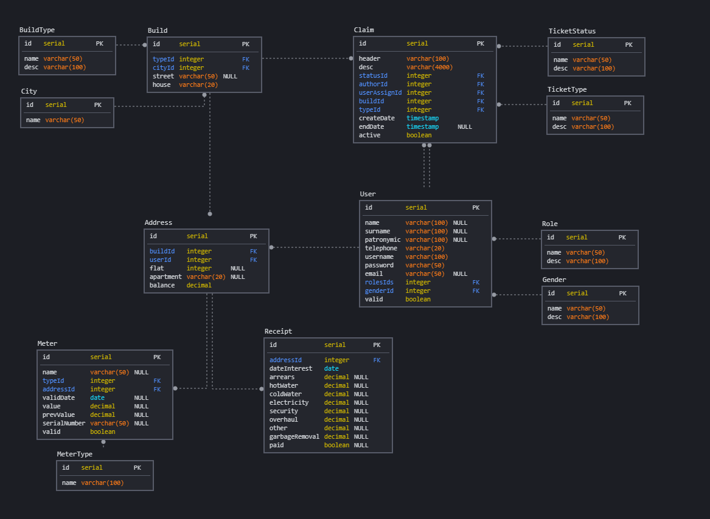

#Домашнее задание #1

##Цель:
Спроектировать свою первую базу данных на курсе

В проекте должны быть
- схема
- документация
- примеры бизнес-задач которые решает база
* рекомендации к использованию репликации
* рекомендации к резервному копированию

## Содержание
* [1. Схема](#Schema)
* [2. Документация](#Doc)
* [3. Примеры бизнес-задач, которые решает база данных](#Example)
* [4. Рекомендации к использованию репликации](#Replication)
* [5. Рекомендации к резервному копированию](#Backup)

###  1. Схема

###  2. Документация
* Build - Подключенное здание которому предоставляется ЖКХ услуги
  - id
  - typeId - тип постройки
  - cityId - код города
  - street - название улицы
  - house - номер дома
* BuildType - Тип здания (Многоквартирный дом, частный участок, гараж, магазин ...)
  - id
  - name - название типа здания
  - desc - описание типа здания
* City - Город
  - id
  - name - название города
* Address - Адрес по которому предоставляется услуга
  - id
  - buildId - идентификатор постройки
  - userId - идентификатор пользователя
  - flat - этаж
  - apartment - квартира
  - balance - сумма на балансе адреса
* Receipt - Ежемесячный счёт за ЖКХ услуги
  - id
  - addressId - идентификатор адреса
  - dateInterest - дата начисления
  - arrears - задолженность
  - hotWater - начисление за использование горячей воды
  - coldWater - начисление за использование холодной воды
  - electricity - начисление за использованную эл. энергию
  - security - начисление за охрану
  - overhaul - начисление за капитальный ремонт
  - garbageRemoval - начисление за вывоз мусора
  - other - начисление за разные услуги
  - paid - произведена ли оплата по данному платежу
* Meter - Счётчик
  - id
  - name - название счетчика
  - typeId - тип счетчика
  - addressId - идентификатор постройки к которому привязан прибор
  - validDate - дата проверки
  - value - значение счётчика
  - prevValue - предыдущее значение счётчика
  - serialNumber - серийный номер счётчика
  - valid - используется ли счётчик
* MeterType - Тип счётчика
  - id
  - name - Название типа счётчик
* User - Пользователь
  - id
  - name - имя
  - surname - фамилия
  - patronymic - отчество
  - telephone - телефонный номер
  - password - пароль
  - email - электронная почта
  - rolesIds - тип ролей пользователя
  - genderId - половая принадлежность
  - valid - активированная ли учетная запись
* Role - Роль пользователя (клиент, оператор, исполнитель услуг ...)
  - id
  - name - название роли
  - desc - описание роли
* Gender - Половая принадлежность
  - id
  - name - название половая принадлежности
  - desc - описание половая принадлежности
* Claim - Заявка/Жалоба на предоставление услуги
  - id
  - header - заголовок заявки
  - desc - описание заявки
  - desc - описание заявки
  - statusId - идентификатор статуса заявки
  - authorId - идентификатор пользователя который завёл заявку
  - userAssignId - идентификатор пользователя на котором находится заявка
  - buildId - идентификатор строения по которому необходимо произвести услугу
  - typeId - идентификатор услуги
  - createDate - дата заведения заявки на услуги
  - endDate - дата завершения заявки на услуги
  - active - выполнена ли заявка
* TicketStatus - Статус заявки (Создана, в работе, выполнена, отправлена на доработку ...)
  - id
  - name - название статуса
  - desc - описание статуса
* TicketType - Тип заявки (Вызов сантехника, вызов электрика, сломан лифт, сломалось общедомовое оборудывание ... )
  - id
  - name - название типа заявки
  - desc - описание типа заявки

###  3. Примеры бизнес-задач которые решает база
* Пользователь
  - Просмотр личного кабинета
  - Просмотр начислений за ЖКХ услуги
  - Подача показаний счётчиков
  - Подача заявок на получение услуги
  - Подача жалоб на оказанные услуги
* Оператор
  - Обработка заявок/жалоб
  - Назначение на исполнителя задачи
  - Просмотр карточки клиента
* Исполнитель задачи
  - Просмотр назначенных задач
  - Изменение статуса задачи
  - Просмотр карточки клиента

###  4. Рекомендации к использованию репликации
В репликации не нуждается

###  5. Рекомендации к резервному копированию
Необходим автоматический еженедельный бэкап данных