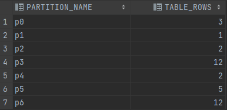

# Домашнее задание №11

Партиционирование таблицы

## Цель:

Применить партиционирование по типу RANGE (по диапазону значений) к таблице своей БД

1) Применить инструкцию к одной из своих таблиц БД, таблица должна быть заполнена данными: ALTER TABLE your_table
   PARTITION BY RANGE (your_field) (
   PARTITION p0 VALUES LESS THAN (10), PARTITION p1 VALUES LESS THAN (20), PARTITION p2 VALUES LESS THAN (MAXVALUE)
   );
2) Выполнить запрос: SELECT p.PARTITION_NAME, p.TABLE_ROWS FROM INFORMATION_SCHEMA.PARTITIONS p WHERE TABLE_NAME = '
   your_table';
3) Результат выборки разместить в README

### Применить инструкцию к одной из своих таблиц БД

````
ALTER TABLE AddressStatistic PARTITION BY RANGE (id) (
    PARTITION p0 VALUES LESS THAN (1000),
    PARTITION p1 VALUES LESS THAN (2000),
    PARTITION p2 VALUES LESS THAN (3000),
    PARTITION p3 VALUES LESS THAN (4000),
    PARTITION p4 VALUES LESS THAN (5000),
    PARTITION p5 VALUES LESS THAN (6000),
    PARTITION p6 VALUES LESS THAN MAXVALUE
    );
````

### Выполнить запрос: SELECT p.PARTITION_NAME, p.TABLE_ROWS FROM INFORMATION_SCHEMA.PARTITIONS p WHERE TABLE_NAME = 'your_table';


