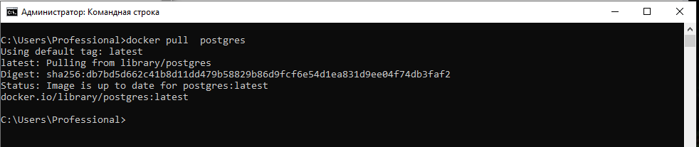
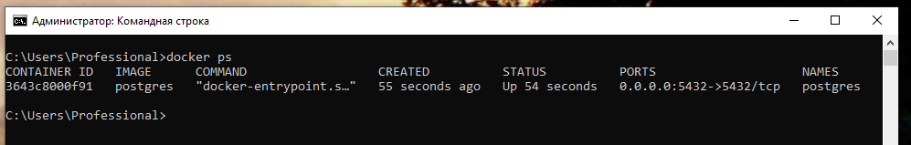
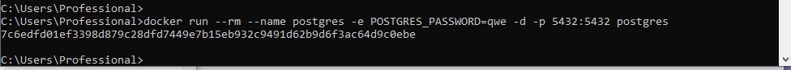
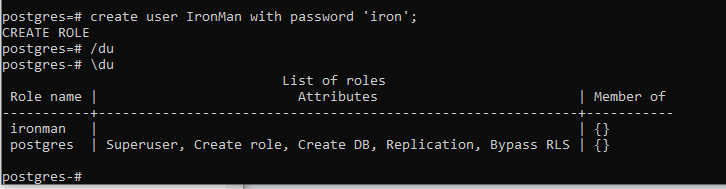
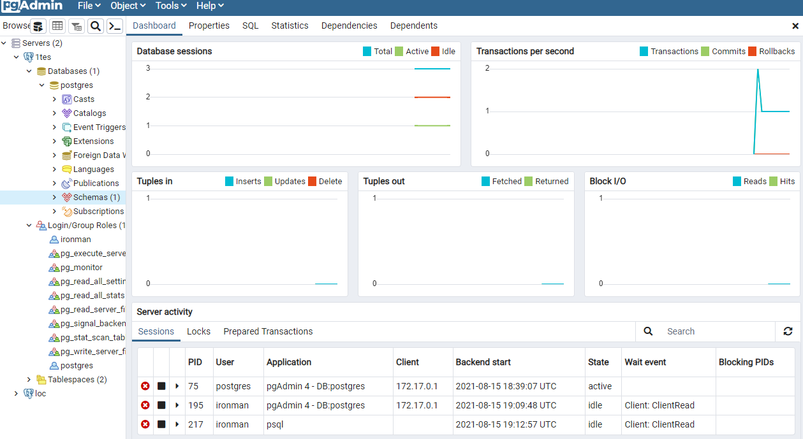

# Домашнее задание №3

*Установка СУБД PostgreSQL

## Цель:

* Создать кластер PostgreSQL в докере или на виртуальной машине, запустить сервер и подключить клиента! 
* Развернуть контейнер с PostgreSQL или установить СУБД на виртуальную машину. 
    
* Запустить сервер.  
  
* Создать клиента с подключением к базе данных postgres через командную строку. 
  
* Подключиться к серверу используя pgAdmin или другое аналогичное приложение.  
  
  